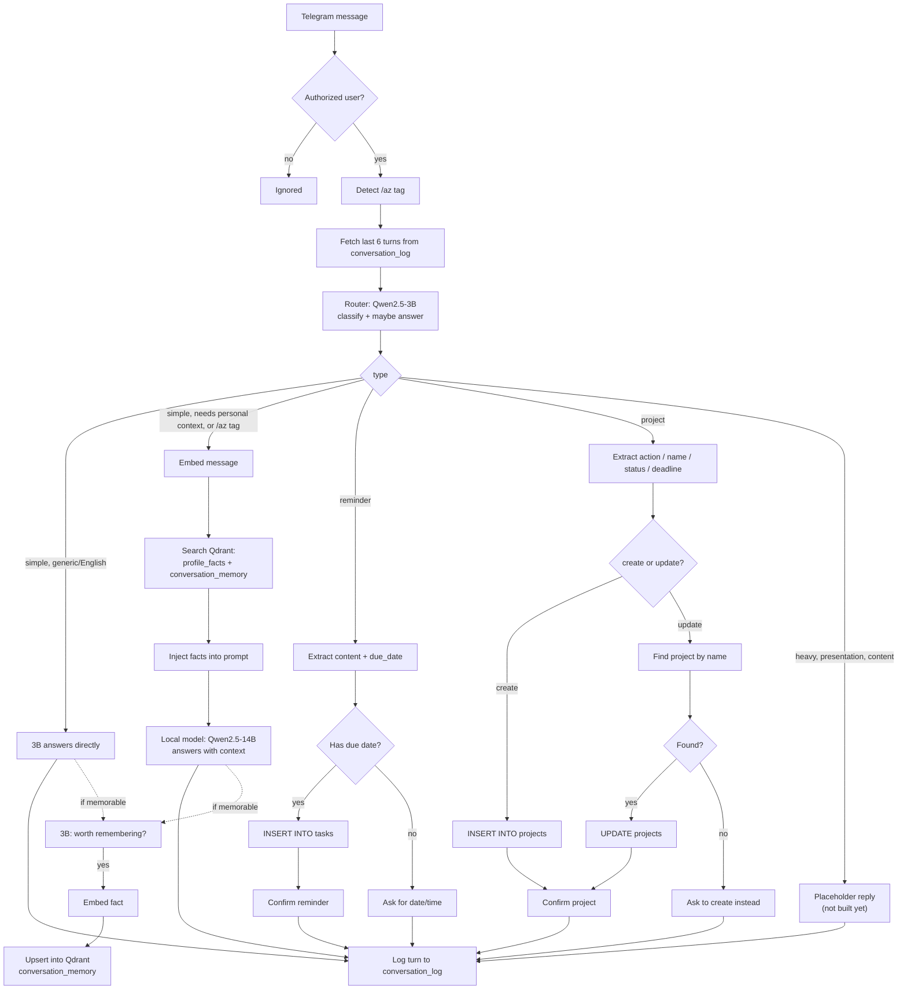
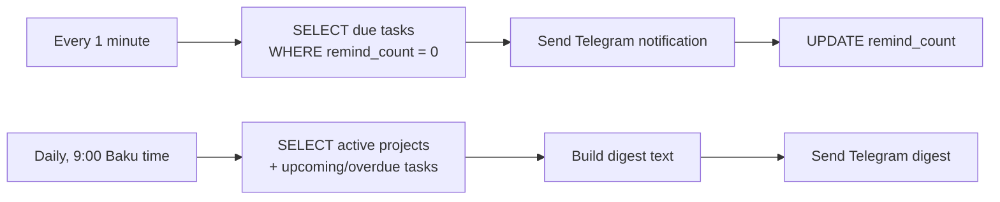

# Message Flow

This documents how a Telegram message actually moves through the system today. It reflects the live n8n workflow, not the original phase plan — see [`PLAN.md`](./PLAN.md) for the higher-level roadmap.

## Main flow — a message arrives

Notes:
- **Only n8n ever talks to Qdrant or Postgres.** No model has tool/function-calling access to either — every LLM call here is plain text in, text out. n8n does the embedding, the vector search, and pastes results into the next prompt as plain text.
- The 3B router is also the model used for reminder/project extraction and the "worth remembering?" memory check — it's the cheap, fast model reused across several narrow-purpose calls, not just classification.
- The 14B local model is the only one with RAG context injected into its prompt; the 3B router never sees retrieved facts, which is why it defers personal questions instead of answering them itself.
- "Last 6 turns" conversation history is injected into the router, reminder-extraction, and project-extraction prompts so short follow-ups ("yes", "in 10 minutes") resolve correctly against what was just asked.

## Background workflows (separate from the message flow above)

- **Cron - Reminder Checker**: runs every minute, fires a reminder exactly once when its `due_date` arrives.
- **Cron - Daily Digest**: runs once a day, summarizes active projects and upcoming reminders in one message.

## RunPod endpoints in play

| Endpoint | Model | Called by | Purpose |
|---|---|---|---|
| Router | Qwen2.5-3B-Instruct | n8n | Classify every message; answer generic `simple` questions directly; extract reminder/project structure; judge memorability |
| Local | Qwen2.5-14B-Instruct | n8n | Answer questions needing personal context (RAG-injected) |
| Embedding | multilingual-e5-small | n8n | Turn text into vectors for Qdrant search/upsert |

All three scale to zero when idle (`workersMin: 0`, `idleTimeout: 120s`) — cost is paid in cold-start latency, not idle GPU time. See [`PLAN.md`](./PLAN.md) for the reasoning behind that tradeoff.
